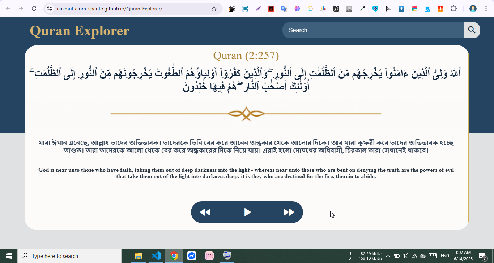

# Quran Explorer

**Developed by: Nazmul Alom Shanto**

Welcome to **Quran Explorer** — a web application designed to deepen understanding and connection with the Holy Quran.

As a **Hafez of the Quran**, I created this tool to apply what I’ve memorized and to truly understand the meaning behind each verse. This project is a step toward making it a daily habit to explore and reflect on the meanings of the Quran.

---
> **Quran Explorer**
>

## 🌟 Key Features

### 📖 Learn the Meaning Daily
Designed to support daily engagement with Quranic verses. Ideal for anyone who wants to better understand what they’ve memorized or read.

### 🔍 Powerful Search Function
Quickly find any verse using the Surah Name & Ayah Number.  
**Example**: To find Ayah 255 from Surah 2 (Al-Baqarah), 1st select Al-Baqarah from search dropdown then add the ayah number.

### 🔊 Audio Playback

Enhance your memorization and pronunciation with clear, high-quality recitation by **Qari Sheikh Mishary Rashid Alafasy**, available for every verse.

### 🎨 Clean, User-Friendly Design
The interface is simple and focused — helping you stay immersed in the message.  
> *Design concept generated with the help of ChatGPT (PNG format).*

---

## 🚀 Development Info

- **Build Time:** 2 day  
- **Live Demo:** [Quran Explorer](https://nazmul-alom-shanto.github.io/Quran-Explorer/)  
- **Technologies Used:** HTML, CSS, JavaScript

---
## License

This project is licensed under the [MIT License](./LICENSE).

---
## 🤲 Why I Built This

Understanding the Quran is just as important as memorizing it. I hope this tool helps others — especially fellow Huffaz — reflect on the verses they recite and carry in their hearts.

---

Feel free to contribute or share your feedback.  
**May Allah accept our efforts. Ameen.**
